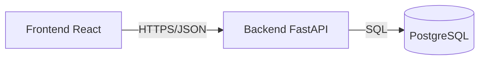

# NOMAD - Controle Financeiro Pessoal


O **NOMAD** é uma solução *full-stack* robusta para gestão financeira pessoal e de pequenas empresas. Desenvolvido com foco em performance, segurança e experiência do usuário, o sistema opera como uma Progressive Web App (PWA), garantindo funcionalidade offline e instalação nativa em dispositivos móveis e desktops.

## 🚀 Demonstração em Produção

Acesse a aplicação em tempo real:

*   **Frontend (Aplicação Web):** [https://controle-financeiro-api-eight.vercel.app](https://controle-financeiro-api-eight.vercel.app)
*   **Backend (Documentação API):** [https://controle-financeiro-api-ulpp.onrender.com/docs](https://controle-financeiro-api-ulpp.onrender.com/docs)

> [!NOTE]
> O ambiente de produção utiliza serviços gratuitos que podem entrar em modo de hibernação. A primeira requisição pode levar alguns instantes para inicializar o servidor.

---

## 📚 Documentação do Código

O projeto possui documentação completa inline em todos os módulos, classes e funções.
*   **Backend (Python):** Documentado seguindo o padrão Google Style Python Docstrings.
*   **Frontend (JavaScript/React):** Documentado seguindo o padrão JSDoc.

Para entender detalhes específicos de implementação de cada componente ou endpoint, consulte diretamente os arquivos de código fonte.

---

## 🏛️ Arquitetura do Sistema

O projeto adota uma arquitetura desacoplada moderna, garantindo escalabilidade e manutenibilidade.



### Destaques Arquiteturais
*   **Frontend:** Single Page Application (SPA) construída com React 18 e Vite, otimizada para performance e SEO.
*   **Backend:** API RESTful desenvolvida com FastAPI (Python), utilizando Pydantic para validação rigorosa de dados.
*   **Banco de Dados:** PostgreSQL para produção (Render) e SQLite para desenvolvimento local, gerenciados via SQLAlchemy ORM.
*   **Segurança:** Autenticação via JWT (JSON Web Tokens) e hashing de senhas com Argon2.

---

## ✨ Funcionalidades Principais

### 📱 Experiência do Usuário (UX)
*   **PWA & Offline-First:** Funcionalidade completa mesmo sem conexão à internet, com sincronização automática.
*   **Design Responsivo:** Interface adaptável para mobile, tablet e desktop.
*   **Tema Dinâmico:** Suporte nativo a modos Claro e Escuro.

### 💼 Gestão Financeira
*   **Dashboard Interativo:** Visão geral de receitas, despesas e saldo em tempo real.
*   **Transações:** CRUD completo para registros financeiros.
*   **Categorização:** Sistema flexível de categorias com cores personalizáveis.
*   **Relatórios Avançados:** Gráficos de tendência, distribuição por categoria e exportação para Excel (.xlsx).

### 🔐 Segurança e Perfil
*   **Autenticação Segura:** Login e cadastro protegidos.
*   **Gestão de Perfil:** Atualização de dados cadastrais e alteração segura de senha.

---

## 🛠️ Stack Tecnológico

### Frontend
*   **Core:** React 18, Vite
*   **Roteamento:** React Router DOM
*   **Estado Global:** React Context API
*   **Estilização:** CSS Moderno (Variáveis CSS)
*   **Visualização de Dados:** Recharts

### Backend
*   **Linguagem:** Python 3.12
*   **Framework:** FastAPI
*   **ORM:** SQLAlchemy 2.0
*   **Validação:** Pydantic V2
*   **Servidor:** Uvicorn / Gunicorn

---

## ⚙️ Instalação e Execução Local

Siga os passos abaixo para configurar o ambiente de desenvolvimento.

### Pré-requisitos
*   Python 3.10+
*   Node.js 18+
*   Git

### 1. Configuração do Backend

```bash
# Clone o repositório
git clone https://github.com/alessandrolsdev/controle-financeiro-api.git
cd controle-financeiro-api

# Crie e ative o ambiente virtual
python -m venv venv
# Windows:
.\venv\Scripts\activate
# Linux/Mac:
source venv/bin/activate

# Instale as dependências
pip install -r requirements.txt

# Configure as variáveis de ambiente (.env)
echo "SECRET_KEY=sua_chave_secreta_aqui" > .env

# Inicie o servidor
uvicorn backend.main:app --reload
```
*O backend estará disponível em `http://127.0.0.1:8000`*

### 2. Configuração do Frontend

```bash
# Em um novo terminal, navegue para a pasta frontend
cd frontend

# Crie o arquivo .env
echo "VITE_API_BASE_URL=http://127.0.0.1:8000" > .env

# Instale as dependências
npm install

# Inicie o servidor de desenvolvimento
npm run dev
```
*O frontend estará disponível em `http://localhost:5173`*

---

## 📄 Licença

Este projeto está licenciado sob a licença MIT. Consulte o arquivo LICENSE para mais detalhes.
