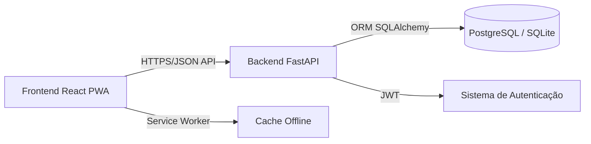

# NOMAD - Controle Financeiro Pessoal


O **NOMAD** é uma solução *full-stack* robusta e profissional para gestão financeira pessoal e de pequenas empresas. Desenvolvido com foco em performance, segurança e experiência do usuário, o sistema opera como uma Progressive Web App (PWA), garantindo funcionalidade offline completa e instalação nativa em dispositivos móveis e desktops.

---

## 🚀 Demonstração em Produção

Acesse a aplicação em tempo real:

*   **Frontend (Aplicação Web):** [https://controle-financeiro-api-eight.vercel.app](https://controle-financeiro-api-eight.vercel.app)
*   **Backend (Documentação API):** [https://controle-financeiro-api-ulpp.onrender.com/docs](https://controle-financeiro-api-ulpp.onrender.com/docs)

> [!NOTE]
> O ambiente de produção utiliza serviços gratuitos que podem entrar em modo de hibernação. A primeira requisição pode levar alguns instantes para inicializar o servidor.

---

## 📑 Índice

- [Documentação do Código](#-documentação-do-código)
- [Arquitetura do Sistema](#-arquitetura-do-sistema)
- [Funcionalidades Principais](#-funcionalidades-principais)
- [Stack Tecnológico](#-stack-tecnológico)
- [Instalação e Execução Local](#-instalação-e-execução-local)
- [Estrutura do Projeto](#-estrutura-do-projeto)
- [Testes](#-testes)
- [Deploy](#-deploy)
- [Contribuindo](#-contribuindo)
- [Licença](#-licença)

---

## 📚 Documentação do Código

O projeto possui documentação inline **completa e profissional** em todos os módulos, classes e funções:

*   **Backend (Python):** Documentado seguindo o padrão **Google Style Python Docstrings**.
*   **Frontend (JavaScript/React):** Documentado seguindo o padrão **JSDoc**.

Cada arquivo do projeto contém:
- Descrição detalhada do propósito e responsabilidades
- Documentação de todas as funções, classes e componentes
- Explicação de parâmetros, tipos de retorno e exceções
- Comentários explicativos sobre lógica complexa

Para entender detalhes específicos de implementação de cada componente ou endpoint, consulte diretamente os arquivos de código fonte.

---

## 🏛️ Arquitetura do Sistema

O projeto adota uma **arquitetura desacoplada moderna**, garantindo escalabilidade, manutenibilidade e separação de responsabilidades.



### Destaques Arquiteturais

#### Backend
*   **Framework:** FastAPI com suporte a async/await para alta performance
*   **ORM:** SQLAlchemy 2.0 com sintaxe moderna (Mapped/mapped_column)
*   **Validação:** Pydantic V2 para validação rigorosa de dados
*   **Segurança:** JWT para autenticação e Argon2 para hashing de senhas
*   **Banco de Dados:** PostgreSQL (produção) e SQLite (desenvolvimento)
*   **Documentação Automática:** OpenAPI/Swagger integrado

#### Frontend
*   **Framework:** React 18 com hooks modernos
*   **Build Tool:** Vite para desenvolvimento rápido e builds otimizados
*   **Roteamento:** React Router DOM v6 com rotas protegidas
*   **Estado Global:** React Context API para gerenciamento de autenticação e tema
*   **Gráficos:** Recharts para visualizações interativas
*   **PWA:** Service Worker para funcionalidade offline completa
*   **Estilização:** CSS moderno com variáveis CSS para temas dinâmicos

---

## ✨ Funcionalidades Principais

### 📱 Experiência do Usuário (UX)
*   **PWA & Offline-First:** Funcionalidade completa mesmo sem conexão à internet, com sincronização automática quando online
*   **Design Responsivo:** Interface adaptável otimizada para mobile, tablet e desktop
*   **Tema Dinâmico:** Suporte nativo a modos Claro e Escuro com persistência de preferência

### 💼 Gestão Financeira
*   **Dashboard Interativo:** Visão geral de receitas, despesas e saldo em tempo real
*   **Transações CRUD Completo:** Criar, visualizar, editar e excluir registros financeiros
*   **Categorização Inteligente:** Sistema flexível de categorias com cores personalizáveis e tipos (Receita/Gasto)
*   **Filtros Avançados:** Filtragem por data (diária, semanal, mensal, anual e personalizada)
*   **Relatórios Visuais:** Gráficos de tendência, distribuição por categoria com dados em tempo real
*   **Exportação de Dados:** Suporte para exportação de relatórios (futuro: Excel, PDF)

### 🔐 Segurança e Autenticação
*   **Autenticação JWT:** Sistema seguro de tokens com expiração configurável
*   **Criptografia de Senhas:** Hashing com Argon2 (algoritmo recomendado pela OWASP)
*   **Proteção de Rotas:** Sistema de rotas protegidas no frontend
*   **Validação de Dados:** Validação rigorosa em ambos backend e frontend
*   **Gerenciamento de Perfil:** Atualização de dados cadastrais e alteração segura de senha

---

## 🛠️ Stack Tecnológico

### Backend
| Tecnologia | Versão | Finalidade |
|------------|--------|------------|
| Python | 3.12+ | Linguagem base |
| FastAPI | 0.115+ | Framework web assíncrono |
| SQLAlchemy | 2.0+ | ORM para banco de dados |
| Pydantic | 2.x | Validação de dados |
| Uvicorn | Latest | Servidor ASGI |
| python-jose | Latest | Geração e validação JWT |
| passlib | Latest | Hashing de senhas (Argon2) |
| PostgreSQL | 14+ | Banco de dados (produção) |

### Frontend
| Tecnologia | Versão | Finalidade |
|------------|--------|------------|
| React | 18.3+ | Biblioteca UI |
| Vite | 5.x | Build tool e dev server |
| React Router | 6.x | Roteamento SPA |
| Recharts | 2.x | Visualização de dados |
| Axios | Latest | Cliente HTTP |
| React Icons | Latest | Ícones |

### DevOps & Deploy
*   **Frontend:** Vercel (Deploy automático)
*   **Backend:** Render (PostgreSQL + Uvicorn)
*   **Versionamento:** Git/GitHub

---

## ⚙️ Instalação e Execução Local

### Pré-requisitos

- Python 3.10 ou superior
- Node.js 18 ou superior
- Git

### 1. Configuração do Backend

```bash
# Clone o repositório
git clone https://github.com/alessandrolsdev/controle-financeiro-api.git
cd controle-financeiro-api

# Crie e ative o ambiente virtual
python -m venv venv

# Windows:
.\venv\Scripts\activate

# Linux/Mac:
source venv/bin/activate

# Instale as dependências
pip install -r requirements.txt

# Configure as variáveis de ambiente (.env)
# Crie um arquivo .env na raiz do projeto
echo "SECRET_KEY=sua_chave_secreta_super_segura_aqui" > .env

# Inicie o servidor
uvicorn backend.main:app --reload
```

✅ **O backend estará disponível em `http://127.0.0.1:8000`**  
📖 **Documentação automática em `http://127.0.0.1:8000/docs`**

### 2. Configuração do Frontend

```bash
# Em um novo terminal, navegue para a pasta frontend
cd frontend

# Crie o arquivo .env
echo "VITE_API_BASE_URL=http://127.0.0.1:8000" > .env

# Instale as dependências
npm install

# Inicie o servidor de desenvolvimento
npm run dev
```

✅ **O frontend estará disponível em `http://localhost:5173`**

---

## 📂 Estrutura do Projeto

```
controle-financeiro-api/
├── backend/                    # Backend FastAPI
│   ├── core/                  # Configurações centrais
│   │   ├── __init__.py
│   │   └── config.py          # Settings e variáveis de ambiente
│   ├── crud.py                # Operações CRUD (Create, Read, Update, Delete)
│   ├── database.py            # Configuração do SQLAlchemy
│   ├── main.py                # Aplicação FastAPI e rotas
│   ├── models.py              # Modelos ORM (Usuario, Categoria, Transacao)
│   ├── schemas.py             # Schemas Pydantic (validação)
│   ├── security.py            # Autenticação JWT e hashing de senhas
│   ├── tasks.py               # Tarefas assíncronas (futuro)
│   └── worker.py              # Worker Celery (futuro)
├── frontend/                  # Frontend React
│   ├── public/                # Arquivos públicos e manifest PWA
│   ├── src/
│   │   ├── assets/           # Imagens, logos
│   │   ├── components/       # Componentes reutilizáveis
│   │   │   ├── DoughnutChart/
│   │   │   ├── FilterControls/
│   │   │   ├── HorizontalBarChart/
│   │   │   ├── Navbar/
│   │   │   └── TransactionModal/
│   │   ├── context/          # Contextos React (Auth, Theme)
│   │   ├── layouts/          # Layouts da aplicação
│   │   ├── pages/            # Páginas principais
│   │   │   ├── Dashboard/
│   │   │   ├── Login/
│   │   │   ├── Profile/
│   │   │   ├── Reports/
│   │   │   ├── Settings/
│   │   │   └── SignUp/
│   │   ├── services/         # Configuração de API (axios)
│   │   ├── App.jsx           # Componente raiz e rotas
│   │   ├── main.jsx          # Entry point
│   │   └── index.css         # Estilos globais
│   ├── package.json
│   └── vite.config.js
├── .env                       # Variáveis de ambiente (não versionado)
├── .gitignore
├── requirements.txt           # Dependências Python
└── README.md
```

---

## 🧪 Testes

### Backend
Os endpoints podem ser testados através da documentação automática do FastAPI:
```bash
# Com o servidor rodando, acesse:
http://127.0.0.1:8000/docs
```

### Frontend
```bash
cd frontend
npm run build  # Verifica build de produção
npm run preview  # Preview do build
```

---

## 🚀 Deploy

### Backend (Render)
1. Conecte seu repositório GitHub ao Render
2. Configure as variáveis de ambiente:
   - `SECRET_KEY`
   - `DATABASE_URL` (PostgreSQL fornecido pelo Render)
3. O Render detectará automaticamente o `requirements.txt`

### Frontend (Vercel)
1. Conecte seu repositório GitHub à Vercel
2. Configure:
   - **Build Command:** `npm run build`
   - **Output Directory:** `dist`
   - **Environment Variable:** `VITE_API_BASE_URL` (URL do backend)

---

## 🤝 Contribuindo

Contribuições são bem-vindas! Para contribuir:

1. Faça um fork do projeto
2. Crie uma branch para sua feature (`git checkout -b feature/AmazingFeature`)
3. Commit suas mudanças (`git commit -m 'Add some AmazingFeature'`)
4. Push para a branch (`git push origin feature/AmazingFeature`)
5. Abra um Pull Request

**Padrões de código:**
- Siga os padrões de documentação existentes (Google Docstrings para Python, JSDoc para JavaScript)
- Mantenha o código limpo e bem comentado
- Teste suas mudanças antes de submeter

---

## 📄 Licença

Este projeto está licenciado sob a licença MIT. Consulte o arquivo [LICENSE](LICENSE) para mais detalhes.

---

## 👨‍💻 Autor

Desenvolvido com ❤️ por **Alessandro**

- GitHub: [@alessandrolsdev](https://github.com/alessandrolsdev)
- LinkedIn: [alessandro-luiz-santos](https://www.linkedin.com/in/alessandro-luiz-santos/)

---

<div align="center">

**Se este projeto foi útil para você, considere dar uma ⭐️!**

</div>
