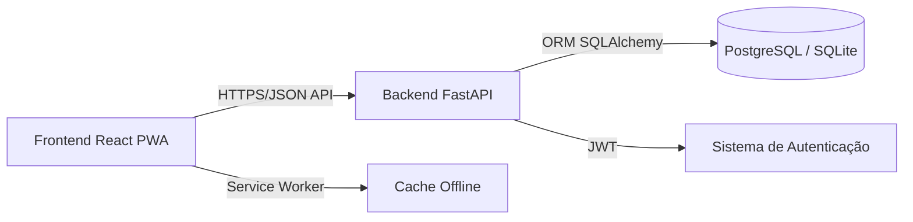

# NOMAD - Controle Financeiro Pessoal


O **NOMAD** é uma solução *full-stack* robusta e profissional para gestão financeira pessoal e de pequenas empresas. Desenvolvido com foco em performance, segurança e experiência do usuário, o sistema opera como uma Progressive Web App (PWA), garantindo funcionalidade offline completa e instalação nativa em dispositivos móveis e desktops.

---

## 🚀 Demonstração em Produção

Acesse a aplicação em tempo real:

*   **Frontend (Aplicação Web):** [https://controle-financeiro-api-eight.vercel.app](https://controle-financeiro-api-eight.vercel.app)
*   **Backend (Documentação API):** [https://controle-financeiro-api-ulpp.onrender.com/docs](https://controle-financeiro-api-ulpp.onrender.com/docs)

> [!NOTE]
> O ambiente de produção utiliza serviços gratuitos que podem entrar em modo de hibernação. A primeira requisição pode levar alguns instantes para inicializar o servidor.

---

## 📑 Índice

- [Documentação do Código](#-documentação-do-código)
- [Arquitetura do Sistema](#-arquitetura-do-sistema)
- [Funcionalidades Principais](#-funcionalidades-principais)
- [Stack Tecnológico](#-stack-tecnológico)
- [Instalação e Execução Local](#-instalação-e-execução-local)
- [Estrutura do Projeto](#-estrutura-do-projeto)
- [Testes](#-testes)
- [Deploy](#-deploy)
- [Contribuindo](#-contribuindo)
- [Licença](#-licença)

---

## 📚 Documentação do Código

O projeto possui documentação inline **completa e profissional** em todos os módulos, classes e funções:

*   **Backend (Python):** Documentado seguindo o padrão **Google Style Python Docstrings**.
*   **Frontend (JavaScript/React):** Documentado seguindo o padrão **JSDoc**.

Cada arquivo do projeto contém:
- Descrição detalhada do propósito e responsabilidades
- Documentação de todas as funções, classes e componentes
- Explicação de parâmetros, tipos de retorno e exceções
- Comentários explicativos sobre lógica complexa

Para entender detalhes específicos de implementação de cada componente ou endpoint, consulte diretamente os arquivos de código fonte.

---

## 🏛️ Arquitetura do Sistema

O projeto adota uma **arquitetura desacoplada moderna**, garantindo escalabilidade, manutenibilidade e separação de responsabilidades.


```mermaid
graph LR
    Client[Frontend React PWA] -- HTTPS/JSON API --> API[Backend FastAPI]
    API -- ORM SQLAlchemy --> DB[(PostgreSQL / SQLite)]
    API -- JWT --> Auth[Sistema de Autenticação]
    Client -- Service Worker --> Cache[Cache Offline]
```

### Destaques Arquiteturais

#### Backend
*   **Framework:** FastAPI com suporte a async/await para alta performance
*   **ORM:** SQLAlchemy 2.0 com sintaxe moderna (Mapped/mapped_column)
*   **Validação:** Pydantic V2 para validação rigorosa de dados
*   **Segurança:** JWT para autenticação e Argon2 para hashing de senhas
*   **Banco de Dados:** PostgreSQL (produção) e SQLite (desenvolvimento)
*   **Documentação Automática:** OpenAPI/Swagger integrado

#### Frontend
*   **Framework:** React 18 com hooks modernos
*   **Build Tool:** Vite para desenvolvimento rápido e builds otimizados
*   **Roteamento:** React Router DOM v6 com rotas protegidas
*   **Estado Global:** React Context API para gerenciamento de autenticação e tema
*   **Gráficos:** Recharts para visualizações interativas
*   **PWA:** Service Worker para funcionalidade offline completa
*   **Estilização:** CSS moderno com variáveis CSS para temas dinâmicos

---

## ✨ Funcionalidades Principais

### 📱 Experiência do Usuário (UX)
*   **PWA & Offline-First:** Funcionalidade completa mesmo sem conexão à internet, com sincronização automática quando online
*   **Design Responsivo:** Interface adaptável otimizada para mobile, tablet e desktop
*   **Tema Dinâmico:** Suporte nativo a modos Claro e Escuro com persistência de preferência

### 📥 Importação
*   **Planilhas CSV e XLSX:** traga o histórico de um extrato bancário sem digitar nada
*   **Reconhecimento de colunas:** aceita os nomes mais comuns em português e inglês
*   **Categorização automática:** classifica por palavras-chave da descrição ("Posto Ipiranga" → Transporte)
*   **Relatório por linha:** uma linha inválida não invalida o arquivo — ela é apontada com o motivo

### 💼 Gestão Financeira
*   **Dashboard Interativo:** Visão geral de receitas, despesas e saldo em tempo real
*   **Transações CRUD Completo:** Criar, visualizar, editar e excluir registros financeiros
*   **Categorização Inteligente:** Sistema flexível de categorias com cores personalizáveis e tipos (Receita/Gasto)
*   **Filtros Avançados:** Filtragem por data (diária, semanal, mensal, anual e personalizada)
*   **Relatórios Visuais:** Gráficos de tendência, distribuição por categoria com dados em tempo real
*   **Exportação de Dados:** Suporte para exportação de relatórios (futuro: Excel, PDF)

### 🔐 Segurança e Autenticação
*   **Sessão em cookies `httpOnly`:** o token fica fora do alcance de JavaScript — um XSS não consegue exfiltrá-lo
*   **Proteção CSRF:** `SameSite=Strict` mais token de double-submit no cabeçalho `X-CSRF-Token`
*   **Refresh token com rotação:** cada uso emite um sucessor; reapresentar um token já usado revoga a sessão inteira
*   **Verificação em duas etapas:** TOTP (RFC 6238) com códigos de recuperação de uso único
*   **Criptografia em repouso:** nome, e-mail, observações e segredo TOTP cifrados com AES-256-GCM
*   **Autenticação JWT:** Tokens assinados com `iss`, `aud`, `iat`, `nbf`, `exp` e `jti`, com algoritmo fixado por allowlist
*   **Revogação de sessões:** Trocar a senha invalida imediatamente todos os tokens já emitidos
*   **Criptografia de Senhas:** Argon2id com parâmetros da RFC 9106 e política mínima de 12 caracteres
*   **Isolamento entre usuários:** Categorias e transações são estritamente escopadas ao dono
*   **Rate limiting:** Proteção contra força bruta no login e no cadastro
*   **Trilha de auditoria:** Toda escrita financeira registra autor, origem e valores alterados
*   **Idempotência:** `Idempotency-Key` impede lançamentos duplicados por retry de rede
*   **Headers de segurança:** HSTS, CSP, anti-clickjacking e `Cache-Control: no-store`
*   **Logs com redação:** Senhas, tokens e credenciais de banco nunca chegam ao log

> Consulte **[SECURITY.md](SECURITY.md)** para o relatório completo da auditoria e o
> checklist obrigatório de implantação em produção.

---

## 🛠️ Stack Tecnológico

### Backend
| Tecnologia | Versão | Finalidade |
|------------|--------|------------|
| Python | 3.12+ | Linguagem base |
| FastAPI | 0.141 | Framework web assíncrono |
| SQLAlchemy | 2.0 | ORM para banco de dados |
| Alembic | 1.16 | Migrações versionadas de esquema |
| Pydantic | 2.13 | Validação de dados |
| Uvicorn | 0.38 | Servidor ASGI |
| PyJWT | 2.13 | Geração e validação JWT |
| argon2-cffi | 25.1 | Hashing de senhas (Argon2id) |
| cryptography | 50.0 | AES-256-GCM para dados em repouso |
| openpyxl | 3.1 | Leitura de planilhas na importação |
| psycopg | 3.2 | Driver PostgreSQL |
| PostgreSQL | 14+ | Banco de dados (produção) |

### Frontend
| Tecnologia | Versão | Finalidade |
|------------|--------|------------|
| React | 19.1 | Biblioteca UI |
| Vite | 7.x | Build tool e dev server |
| React Router | 7.x | Roteamento SPA |
| Recharts | 3.x | Visualização de dados |
| Axios | Latest | Cliente HTTP |
| React Icons | Latest | Ícones |

### DevOps & Deploy
*   **Frontend:** Vercel (Deploy automático)
*   **Backend:** Render (PostgreSQL + Uvicorn)
*   **Versionamento:** Git/GitHub

---

## ⚙️ Instalação e Execução Local

### Pré-requisitos

- Python 3.10 ou superior
- Node.js 18 ou superior
- Git

### Configuração segura de ambiente local

Antes de iniciar o backend ou o frontend, crie os arquivos locais a partir dos exemplos:

```bash
cp .env.example .env
cp frontend/.env.example frontend/.env
```

Depois, preencha apenas valores locais nos arquivos `.env`. Esses arquivos nunca devem ser commitados.

Gere uma `SECRET_KEY` própria — a aplicação recusa iniciar sem uma chave forte:

```bash
python -c "import secrets; print(secrets.token_urlsafe(64))"
```

> [!WARNING]
> Versões anteriores deste README instruíam a usar a chave de exemplo da documentação
> do FastAPI (`09d25e09...`). Essa chave é **pública**: quem a conhece consegue forjar
> tokens de qualquer usuário. Se alguma implantação sua foi criada seguindo aquelas
> instruções, **rotacione a `SECRET_KEY` agora**. A aplicação passou a rejeitar essa
> chave explicitamente. Detalhes em [SECURITY.md](SECURITY.md).

### 1. Configuração do Backend

```bash
# Clone o repositório
git clone https://github.com/alessandrolsdev/controle-financeiro-api.git
cd controle-financeiro-api

# Crie e ative o ambiente virtual
python -m venv venv

# Windows:
.\venv\Scripts\activate

# Linux/Mac:
source venv/bin/activate

# Instale as dependências
pip install -r requirements.txt

# Configure as variáveis de ambiente locais
cp .env.example .env
# Preencha SECRET_KEY e ENCRYPTION_KEY no .env antes de continuar
# (duas chaves DIFERENTES, geradas pelo comando acima)

# Crie o esquema do banco (o schema é gerido por migrações, não por create_all)
alembic upgrade head

# Inicie o servidor
uvicorn backend.main:app --reload
```

> Já tem um banco criado pela versão anterior (que usava `create_all`)? Marque o
> estado inicial antes de migrar:
> ```bash
> alembic stamp 0001 && alembic upgrade head
> ```

✅ **O backend estará disponível em `http://127.0.0.1:8000`**  
📖 **Documentação automática em `http://127.0.0.1:8000/docs`**

### 2. Configuração do Frontend

```bash
# Em um novo terminal, navegue para a pasta frontend
cd frontend

# Configure as variáveis de ambiente locais
cp .env.example .env

# Instale as dependências
npm install

# Inicie o servidor de desenvolvimento
npm run dev
```

✅ **O frontend estará disponível em `http://localhost:5173`**

---

## 📂 Estrutura do Projeto

```
controle-financeiro-api/
├── backend/                    # Backend FastAPI
│   ├── core/                  # Configurações centrais
│   │   ├── __init__.py
│   │   ├── config.py          # Settings validadas e variáveis de ambiente
│   │   ├── cripto.py          # Cifragem de campos e índice cego
│   │   ├── logging.py         # Log estruturado com redação de segredos
│   │   ├── middleware.py      # Headers de segurança e log de requisições
│   │   └── rate_limit.py      # Limitação de taxa (memória ou Redis)
│   ├── crud.py                # Operações CRUD (Create, Read, Update, Delete)
│   ├── database.py            # Configuração do SQLAlchemy
│   ├── main.py                # Aplicação FastAPI e rotas
│   ├── models.py              # Modelos ORM (Usuario, Categoria, Transacao)
│   ├── schemas.py             # Schemas Pydantic (validação)
│   ├── security.py            # JWT, hashing de senhas e refresh tokens
│   ├── sessoes.py             # Cookies, CSRF e rotação de refresh token
│   ├── mfa.py                 # TOTP e códigos de recuperação
│   ├── importacao.py          # Leitura de planilhas CSV/XLSX
│   └── dependencies.py        # Injeção de sessão, usuário atual e rate limit
├── alembic/                   # Migrações versionadas de banco
│   └── versions/
├── tests/                     # Suíte de testes de segurança e integridade
├── frontend/                  # Frontend React
│   ├── public/                # Arquivos públicos e manifest PWA
│   ├── src/
│   │   ├── assets/           # Imagens, logos
│   │   ├── components/       # Componentes reutilizáveis
│   │   │   ├── DoughnutChart/
│   │   │   ├── FilterControls/
│   │   │   ├── HorizontalBarChart/
│   │   │   ├── Navbar/
│   │   │   └── TransactionModal/
│   │   ├── context/          # Contextos React (Auth, Theme)
│   │   ├── layouts/          # Layouts da aplicação
│   │   ├── pages/            # Páginas principais
│   │   │   ├── Dashboard/
│   │   │   ├── Login/
│   │   │   ├── Profile/
│   │   │   ├── Reports/
│   │   │   ├── Settings/
│   │   │   └── SignUp/
│   │   ├── services/         # Configuração de API (axios)
│   │   ├── App.jsx           # Componente raiz e rotas
│   │   ├── main.jsx          # Entry point
│   │   └── index.css         # Estilos globais
│   ├── package.json
│   └── vite.config.js
├── .env                       # Variáveis de ambiente (não versionado)
├── .gitignore
├── alembic.ini                # Configuração do Alembic
├── requirements.txt           # Dependências Python (fixadas e auditadas)
├── requirements-dev.txt       # Testes e ferramentas de segurança
├── SECURITY.md                # Relatório de auditoria e checklist de produção
└── README.md
```

---

## 🧪 Testes

### Backend

```bash
pip install -r requirements-dev.txt

pytest                 # suíte completa (isolamento entre usuários, JWT, integridade contábil)
pip-audit              # CVEs conhecidas nas dependências
bandit -r backend/     # análise estática de segurança
ruff check backend/    # lint
```

Os endpoints também podem ser explorados pela documentação automática em
`http://127.0.0.1:8000/docs` (desative com `DOCS_ENABLED=false` em produção).

### Frontend
```bash
cd frontend
npm audit        # CVEs conhecidas nas dependências
npm run build    # Verifica build de produção
npm run preview  # Preview do build
```

---

## 🚀 Deploy

### Backend (Render)
1. Conecte seu repositório GitHub ao Render
2. Configure as variáveis de ambiente:
   - `ENVIRONMENT=production`
   - `SECRET_KEY` (nova, exclusiva deste ambiente — veja [SECURITY.md](SECURITY.md))
   - `DATABASE_URL` (PostgreSQL fornecido pelo Render)
   - `CORS_ORIGINS` (a URL exata do frontend, sem curinga)
   - `TRUSTED_HOSTS` (o host da API)
   - `ENCRYPTION_KEY` (outra chave, **diferente** da `SECRET_KEY`)
   - `DOCS_ENABLED=false`
   - `REDIS_URL` (obrigatório se `WEB_CONCURRENCY > 1`)
3. O Render detectará automaticamente o `requirements.txt`
4. Defina o comando de start aplicando as migrações antes de subir:
   `alembic upgrade head && gunicorn backend.main:app -k uvicorn.workers.UvicornWorker`

> A aplicação **falha ao iniciar** se qualquer variável acima estiver ausente ou
> insegura em produção. É intencional: melhor não subir do que subir vulnerável.

### Frontend (Vercel)
1. Conecte seu repositório GitHub à Vercel
2. Configure:
   - **Build Command:** `npm run build`
   - **Output Directory:** `dist`
   - **Environment Variable:** `VITE_API_BASE_URL` (URL do backend)

---

## 🤝 Contribuindo

Contribuições são bem-vindas! Para contribuir:

1. Faça um fork do projeto
2. Crie uma branch para sua feature (`git checkout -b feature/AmazingFeature`)
3. Commit suas mudanças (`git commit -m 'Add some AmazingFeature'`)
4. Push para a branch (`git push origin feature/AmazingFeature`)
5. Abra um Pull Request

**Padrões de código:**
- Siga os padrões de documentação existentes (Google Docstrings para Python, JSDoc para JavaScript)
- Mantenha o código limpo e bem comentado
- Teste suas mudanças antes de submeter

---

## 📄 Licença

Este projeto está licenciado sob a licença MIT. Consulte o arquivo [LICENSE](LICENSE) para mais detalhes.

---

## 👨‍💻 Autor

Desenvolvido com ❤️ por **Alessandro**

- GitHub: [@alessandrolsdev](https://github.com/alessandrolsdev)
- LinkedIn: [alessandro-luiz-santos](https://www.linkedin.com/in/alessandro-luiz-santos/)

---

<div align="center">

**Se este projeto foi útil para você, considere dar uma ⭐️!**

</div>
